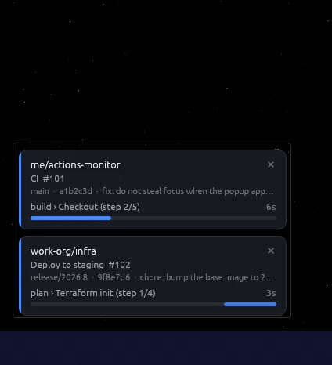

# actions-monitor

[](LICENSE)
[](#)
[](https://www.rust-lang.org/)

A small Windows desktop utility that watches your GitHub accounts for running
Actions workflows and shows a compact, always-on-top popup while anything is in
flight. When nothing is running it is completely invisible — no window, no
taskbar entry, just a background process using almost nothing.

<p align="center">
  
</p>

It is built for having more than one GitHub identity: a personal account, a work
one, an org you contribute to. Each gets its own token and is polled completely
independently, but they all share one stack of cards. There is no limit on how
many you configure.

**It never takes focus.** The popup cannot pull the foreground away from what
you are doing, has no taskbar button and no Alt-Tab entry, and disappears on its
own once the last run finishes. Idle polling uses conditional requests, so
watching a few dozen repos costs essentially no rate limit.

## What a card shows

| Line | Contents |
| --- | --- |
| 1 | `owner/repo`, and a `✕` that dismisses just this run |
| 2 | Workflow name and run number |
| 3 | Branch, short commit SHA, first line of the commit message |
| 4 | Current job and step (`deploy › build (step 3/7)`), and elapsed time, ticking live |
| 5 | Estimated progress bar |

Clicking anywhere else on a card opens that run on github.com in your default
browser. A card you dismiss with `✕` stays dismissed for the rest of that run,
even while it is still going.

The left stripe and the bar are colour-coded: blue while running, grey while
queued, then green / red / amber for success, failure and cancellation. When the
last run finishes each card lingers for `linger_seconds` (8 by default) showing
its result, and then the window disappears entirely.

## Install

```powershell
cargo build --release
# the single binary is target\release\actions-monitor.exe — copy it anywhere
```

Start it once to have it write a configuration template and open it in your
editor:

```powershell
.\actions-monitor.exe
```

Then fill the template in (see below), and start it again. To have it run at
every sign-in:

```powershell
.\actions-monitor.exe --install-autostart    # writes an HKCU\...\Run entry
.\actions-monitor.exe --autostart-status     # check what is registered
.\actions-monitor.exe --uninstall-autostart  # undo it
```

Autostart points at wherever the exe currently lives, so register it *after*
putting the binary where you want it to stay. It uses `HKEY_CURRENT_USER`, so it
needs no elevation and follows your user account rather than the machine.

## Creating the tokens

You need one personal access token per account. The app only ever reads: it
issues `GET` requests to three Actions endpoints and, for `auto_discover`, to
`/user/repos`. It never writes anything to GitHub.

**Fine-grained token** (recommended) —
<https://github.com/settings/personal-access-tokens/new>

- *Resource owner*: your own account, or the organisation that owns the repos.
- *Repository access*: "Only select repositories" and pick the ones you want
  watched, or "All repositories" if you want to use `auto_discover`.
- *Repository permissions*:
  - **Actions → Read-only** — required; this is what lists workflow runs and jobs.
  - **Metadata → Read-only** — required, and granted automatically.

Nothing else is needed.

**Classic token** — <https://github.com/settings/tokens/new>

Tick **exactly one** box:

| Tick | When |
| --- | --- |
| `repo` | Any repo you want to watch is **private**. This is the only classic scope that grants private Actions access. |
| `public_repo` | Every repo you want to watch is **public**. Ticking `repo` already covers public repos, so never tick both. |

Nothing else is needed. In particular **do not tick `workflow`** - that grants
permission to *modify* workflow files and this app never writes. `read:org`,
`admin:org`, `notifications`, `user` and the rest are all irrelevant here.

Be aware that classic `repo` means "full control of private repositories" -
read *and* write, across everything your account can see. There is no read-only
classic equivalent, which is the main reason to prefer a fine-grained token.

If your organisation enforces SAML SSO, open the token afterwards, click
**Configure SSO**, and authorise the organisation. Without this every request
comes back 403 and the account is skipped.

## Configuring your accounts

The config lives at `%APPDATA%\actions-monitor\config.toml`. It is re-read
whenever you save it — no restart needed.

```toml
poll_idle_seconds = 60      # defaults shown; all three are optional
poll_active_seconds = 5
linger_seconds = 8

[[accounts]]
name = "personal"
token = "github_pat_..."    # a literal token, or use token_env instead
auto_discover = true        # watch everything you have pushed to lately
repos = []                  # ignored while auto_discover is true

[[accounts]]
name = "work"
token_env = "GH_TOKEN_WORK" # read the token from this environment variable
auto_discover = false
repos = ["work-org/app", "work-org/infra"]
```

Add as many `[[accounts]]` blocks as you have tokens - two, four, a dozen. Each
one polls on its own task with its own rate-limit budget, so accounts never
interfere with each other and one failing does not affect the rest. The only
rule is that `name` must be unique.

Every account needs **exactly one** of `token` or `token_env`, and either
`auto_discover = true` or a non-empty `repos` list. Anything else is rejected at
load time with a message saying which account is wrong, rather than failing
quietly at the first poll. Run `--check` after editing to confirm.

Watching the same repository from two accounts is fine - it is easy to do by
accident, with one account listing it explicitly and another auto-discovering
it. A run there is still one run and gets one card, not two.

To keep tokens out of the file, set an environment variable instead:

```powershell
setx GH_TOKEN_WORK "github_pat_..."
```

then open a new terminal (or sign out and back in) so the app can see it.

### Ignoring repositories

`auto_discover` is deliberately blunt — everything you pushed to recently — so
`exclude` is how you say "except those". It applies to explicitly listed repos
too, and is applied *before* `discover_max_repos`, so excluding a noisy org frees
up slots rather than wasting them.

```toml
[[accounts]]
name = "personal"
token_env = "GH_TOKEN_PERSONAL"
auto_discover = true
exclude = [
  "some-org",             # every repo owned by some-org
  "me/scratch",           # exactly that repo
  "me/experiment-*",      # anything starting experiment-
  "*/dotfiles",           # a repo of that name under any owner
]
```

A bare `owner` means that whole owner, `*` matches any run of characters and `?`
matches one, in either half of the pattern. Matching is case-insensitive.
`--check` lists what each pattern removed, so an over-eager exclusion is visible
rather than mysterious.

### Per-account options

| Key | Default | Meaning |
| --- | --- | --- |
| `name` | — | Any label you like; it appears in the logs and on error cards |
| `token` / `token_env` | — | The token itself, or the name of an env var holding it |
| `auto_discover` | `false` | Watch recently-pushed repos instead of a fixed list |
| `repos` | `[]` | Explicit `owner/repo` list |
| `exclude` | `[]` | Patterns never to watch (see above) |
| `discover_days` | `30` | How far back "recently pushed" reaches |
| `discover_max_repos` | `25` | Cap on auto-discovered repos, to bound the fan-out |

If a token is rejected, a red card names the account and polling stops for that
account only — the other account keeps working. Fix the token, save the file,
and polling restarts automatically.

## Tray icon

There is an icon in the notification area whose colour is the current status at
a glance: grey when idle, blue while a run is in progress, then green, red or
amber for the last result, and red whenever an account has stopped polling.
Hovering it gives a one-line summary.

- **Left-click** shows what is being watched (the same panel as the menu's first
  item), so the common question is one click away.
- **Right-click** opens the menu, where the maintenance actions live:

| Item | Does |
| --- | --- |
| Show watched repos | Lists every repo being polled, grouped by account, with how long ago each was last checked (same as left-click) |
| Reload config | Re-reads `config.toml` now; a card confirms what happened |
| Open config file… | Opens `config.toml` in your editor |
| Open logs folder… | Opens `%APPDATA%\actions-monitor\logs\` |
| Start with Windows | Toggles the autostart entry; the tick reflects reality |
| Quit actions-monitor | Exits |

> **Windows 11 hides new tray icons.** The first time you run it the icon goes
> into the overflow behind the `^` arrow rather than onto the taskbar. Click
> `^` and drag it out to pin it, or use *Settings → Personalisation → Taskbar →
> Other system tray icons*.

**Show watched repos** — also what a left-click does — answers "is it actually
looking at the thing I care about?", which is otherwise invisible when
auto-discovery decides the list. It
opens a panel above the popup listing each repo with its last successful poll
(`just now`, `2m ago`), marking anything unreadable in red. It is a toggle -
choose it again, click it, or wait 45 seconds and it closes itself. A `304 Not
Modified` counts as a successful check, so a quiet repo still shows a recent
time.

Set `show_tray_icon = false` in the config to go back to a completely invisible
background process.

## Watching another organisation's repos

A personal access token always belongs to a *user*, never to an organisation, so
there is no such thing as an "organisation token" to create here. What matters is
whether your token can see that org's repositories.

**Fine-grained tokens** have exactly one *resource owner*. A token owned by your
user account can only reach repos **you** own — it cannot see an org's repos at
all, however you scope it. To watch `some-org/their-repo` you create a second
fine-grained token whose resource owner is `some-org`, and depending on the org's
settings an owner may have to approve it before it works.

**Classic tokens** are not partitioned that way: one classic token with the `repo`
scope reaches everything your account can see, personal and organisation repos
alike — provided the org has not blocked classic tokens, and that you have
authorised the token for SSO if the org enforces it.

Either way, this is just another `[[accounts]]` block. An "account" here means
"one token plus the repos it watches", not a distinct GitHub login, so use as
many blocks as you have tokens:

```toml
[[accounts]]
name = "personal"
token_env = "GH_TOKEN_PERSONAL"
auto_discover = true
repos = []

[[accounts]]
name = "work"
token_env = "GH_TOKEN_WORK"
auto_discover = false
repos = ["work-org/app"]

[[accounts]]
name = "side-org"                 # a third token, for an org you belong to
token_env = "GH_TOKEN_SIDE_ORG"
auto_discover = false
repos = ["some-org/their-repo"]
```

Note that `auto_discover` only finds what the token can already see, so with a
fine-grained personal token it will never turn up org repos. List those
explicitly, or give the org's token `auto_discover = true` of its own.

## How polling works

The design goal is to be effectively free while idle and responsive while a run
is actually going.

**Idle — every 60s per account.** Each watched repo is asked for its `queued` and
its `in_progress` runs. Every request carries the `ETag` from the previous
response as `If-None-Match`, so an unchanged repo answers `304 Not Modified`.
**304s do not count against the hourly rate limit**, which is what makes
minute-by-minute polling of a couple of dozen repos affordable — the steady-state
cost is close to zero.

With `auto_discover = true` the account's repositories are listed once an hour
(`GET /user/repos?sort=pushed`) and everything pushed to within `discover_days`
becomes the watch list.

**Active — every 5s per run.** As soon as a run appears, that run is refreshed on
the fast cadence: the run itself, plus `GET .../runs/{id}/jobs` to find the
currently executing job and step. Only the run is on the fast path; the other
repos on that account stay on the 60s cadence. When the last run finishes, the
account drops back to idle.

**Rate limits and failures.**

- The `x-ratelimit-remaining` header is read from every response. Below **100
  remaining**, idle polling slows to **5 minutes** and a warning is logged; it
  speeds back up once the window resets.
- `Retry-After`, `429`, and an exhausted limit pause that account until the
  header (or the reset time) says it is safe.
- Network blips retry with exponential backoff — 5s, 10s, 20s … capped at
  **2 minutes**. Nothing is ever surfaced to the UI and the app does not exit.
- A repo that answers `404` or `403` is logged once and skipped, so one
  unreadable repo cannot stop the rest of the account. If *every* watched repo is
  unreadable, a card says so — that is almost always a token-scope mistake.
- `401` is treated as fatal for that account only: a card names it and polling
  stops until the config changes.

## Progress estimates

There is no API for "how far along is this run", so the app learns from
experience. Every **successful** run's duration is appended to
`%APPDATA%\actions-monitor\history.json`, keyed by `owner/repo::workflow`, keeping
the **last 20**. Progress is then `elapsed / median(history)`, capped at **95%**
so an overrunning run looks nearly-done but never finished.

Until a workflow has any history, its bar pulses rather than lying about a
percentage. Only successful runs are recorded, since a failed run usually stops
early and would drag the median down.

## Window behaviour

- Frameless, transparent, rounded, always-on-top, ~340px wide.
- Anchored 16px from the bottom-left corner of the **primary monitor's work
  area**, so it sits above the taskbar wherever the taskbar is. The stack grows
  *upward* as runs are added; the bottom-left corner never moves. A stack too
  tall for the screen is pinned to the top of the work area instead of running
  off it.
- **Never takes focus.** The window carries `WS_EX_NOACTIVATE` and is shown with
  `SW_SHOWNOACTIVATE`, so it cannot pull the foreground away from what you are
  doing, even at the moment it appears or when you click a card.
- **No taskbar button and no Alt-Tab entry** (`WS_EX_TOOLWINDOW`, with
  `WS_EX_APPWINDOW` cleared). These styles are re-asserted every tick, because
  winit rebuilds a window's extended styles from its own flags whenever
  visibility or window level changes and would otherwise silently drop them.
- Position, size and DPI are recomputed continuously, so changing resolution,
  moving the taskbar or switching monitor scaling is picked up without a restart.

## Command line

```
--demo                  Replay a scripted set of fake runs; never contacts GitHub
--console               Keep a console window open with live log output
--verbose               Log at debug level
--check                 Verify the config without starting the UI
--config <PATH>         Use a config file other than the default
--install-autostart     Start actions-monitor when you sign in to Windows
--uninstall-autostart   Undo --install-autostart
--autostart-status      Show whether autostart is currently registered
-h, --help              Show help
-V, --version           Show the version
```

`--check` is the one to run whenever you add an account. It resolves each token,
prints who it belongs to and (for classic tokens) what scopes it carries, lists
exactly which repositories auto-discovery resolves to along with their last-push
times, says how many were skipped and why, and confirms Actions can be read on
each one. It changes nothing and exits 0 only if every account is healthy, so it
works in a script too.

```
account "personal"
  token           : classic (literal token in config.toml)
  identity        : someone
  scopes          : repo
  rate limit      : 4993/5000 remaining, resets in 47m
  auto-discover   : on (pushed within 30 days, at most 10)
  visible to token: 100 repo(s)
  watching        : 9 repo(s):
    someone/project-a                            last push 34m ago
    someone/project-b                            last push 2d ago
  skipped         : 91 (91 not pushed recently, 0 archived or disabled)
  Actions access:
    someone/project-a                            OK
    someone/project-b                            OK
```

Watch the `skipped` line. If repos are dropped for being *over the
discover_max_repos cap*, raise `discover_max_repos` — otherwise those repos are
silently not watched, which is exactly the failure you would never notice.

`--demo` is the quickest way to see the window without waiting for a real
workflow: it replays three runs through queued → running → success / failure /
cancelled → linger → hidden, on a 52-second loop, and exercises both the
estimated and the indeterminate progress bar.

Release builds are Windows-subsystem binaries, so nothing flashes up at login.
Debug builds keep a console, and `--console` gives a release build one too.

## Files

| Path | Contents |
| --- | --- |
| `%APPDATA%\actions-monitor\config.toml` | Accounts, tokens and timings |
| `%APPDATA%\actions-monitor\history.json` | Past run durations, for the estimates |
| `%APPDATA%\actions-monitor\logs\` | Rolling daily log files |

Logs default to info level for this crate and warn for dependencies; `--verbose`
raises it, and `RUST_LOG` overrides it entirely if you set it.

## Troubleshooting

**The tray icon is missing.** It is almost certainly in the Windows 11 overflow
behind the `^` arrow; see the tray section above for how to pin it. If it is not
there either, the log will say `no tray icon:` with a reason.

**Nothing ever appears.** Run with `--console --verbose` and watch the log. The
usual causes are a token without the Actions permission (you will see `403` and
a card saying no repos are readable), SAML SSO not authorised for a work
organisation, or `repos` naming a repo the token cannot see (`404`).

**It appears but the bar never fills.** That workflow has no history yet, so the
bar pulses instead. It starts estimating after the workflow's first successful
run.

**Estimates are wrong after changing a workflow.** Delete
`%APPDATA%\actions-monitor\history.json`; it is rebuilt from scratch.

## Development

```powershell
cargo test          # 91 unit tests, no network or GUI needed
cargo clippy
cargo build --release
```

The code is laid out as:

| Module | Responsibility |
| --- | --- |
| `config` | Parsing, validation, and hot-reload of `config.toml` |
| `github` | The REST client, conditional requests, and API types |
| `poller` | One task per account, the cadence, and error handling |
| `history` | Duration history and progress estimation |
| `model` | The snapshot types shared between backend and UI |
| `state` | The UI's card list, and diffing it against each snapshot |
| `ui` | The eframe/egui app, card painting, and Win32 window behaviour |
| `ui::tray` | The notification-area icon, its menu, and the generated bitmap |
| `check` | The `--check` dry run |
| `filter` | Repository exclusion patterns |

The backend runs on a tokio runtime on its own thread and publishes immutable
snapshots over a `watch` channel; the UI thread diffs each snapshot against the
cards it is already showing, matching on run id, so cards update in place rather
than being recreated.

